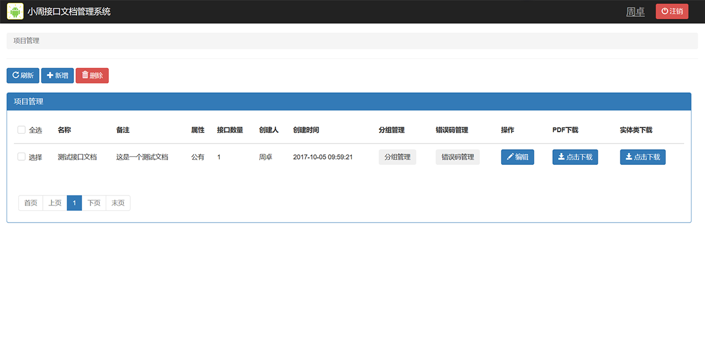
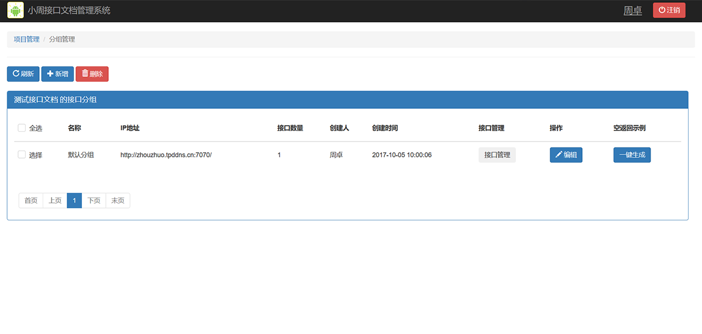
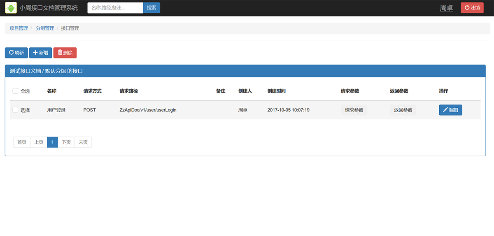
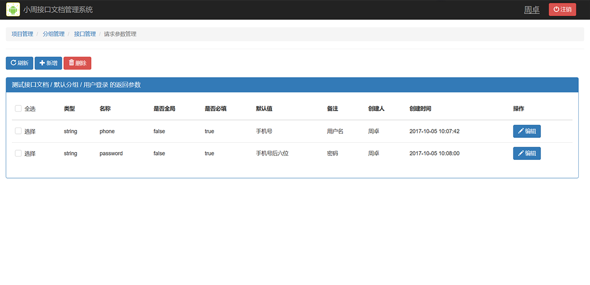
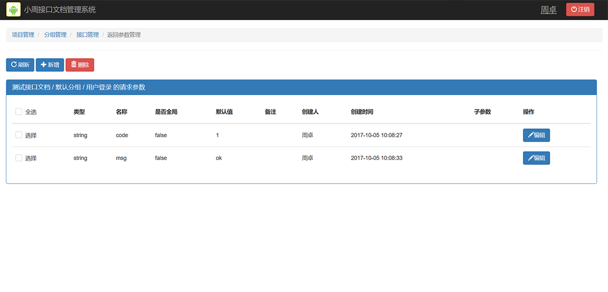
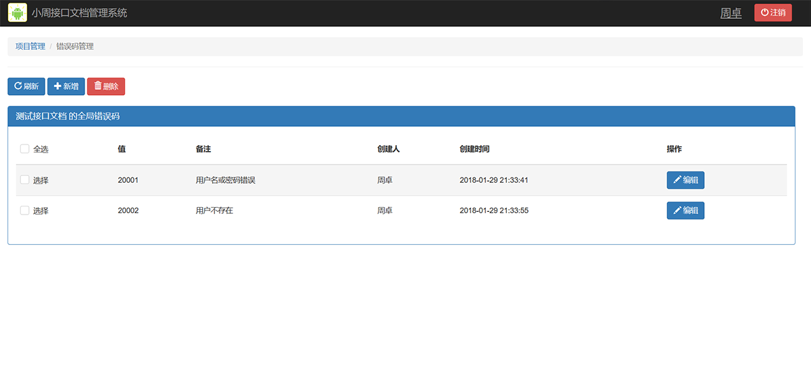

# ZzApiDoc

项目托管地址：[https://github.com/zhouzhuo810/ZzApiDoc](https://github.com/zhouzhuo810/ZzApiDoc)

>小周接口文档在线管理工具-服务+Web端

[在线演示地址](http://zhouzhuo.tpddns.cn:7070/ZzApiDoc/)

### 开发工具
- InteliJ IDEA 2017.1.2

### 功能简介
- 项目管理;
- 接口分组管理;
- 接口管理;
- 请求参数管理;
- 返回参数管理;
- 全局错误码管理;
- PDF文档导出;
- Android RxJava+Retrofit2+OkHttp3接口调用代码和实体类代码下载;

### 生成文档示例

[点击查看](test.pdf)

### 界面截图














>个人邮箱 

<admin@zhouzhuo810.me>

>QQ交流群:154107392 

### 打赏支持


## License
```text
Copyright 2017 zhouzhuo810
  
Licensed under the Apache License, Version 2.0 (the "License");
you may not use this file except in compliance with the License.
You may obtain a copy of the License at
  
   http://www.apache.org/licenses/LICENSE-2.0
  
Unless required by applicable law or agreed to in writing, software
distributed under the License is distributed on an "AS IS" BASIS,
WITHOUT WARRANTIES OR CONDITIONS OF ANY KIND, either express or implied.
See the License for the specific language governing permissions and
limitations under the License.
```